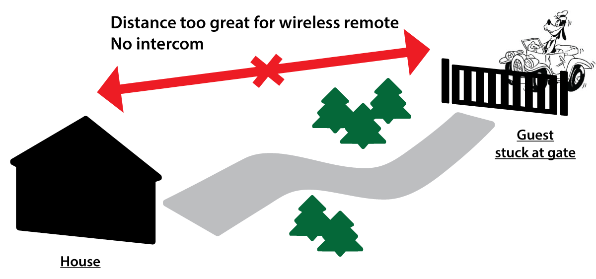
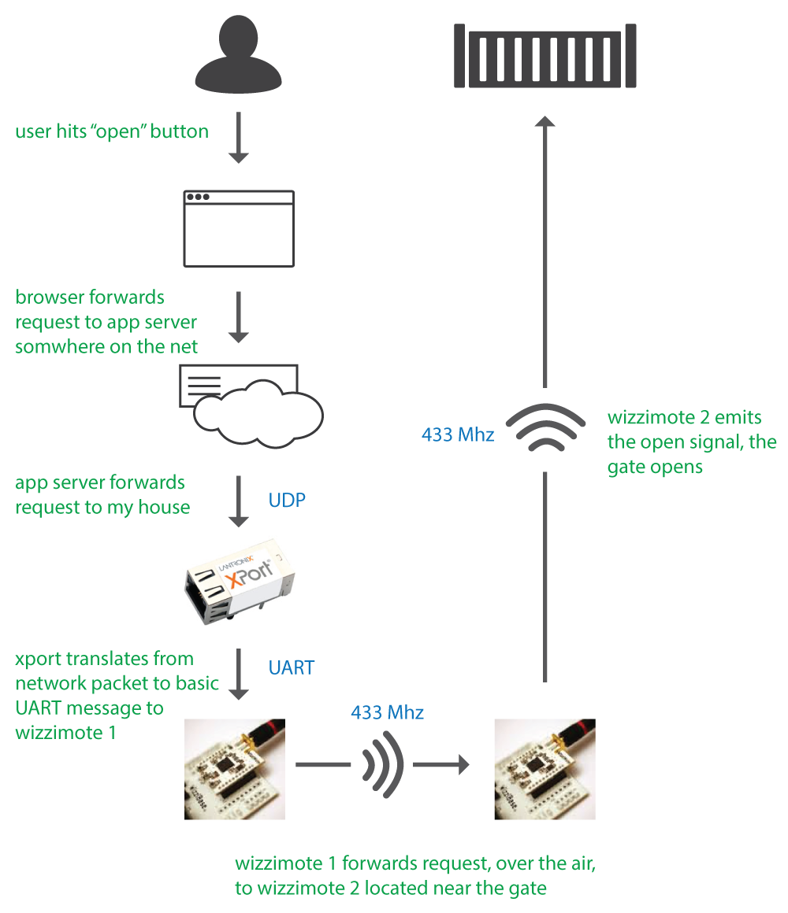

# Portail Notes

What you'll learn about here is how I used sub-Ghz radios, a laser and an xport to connect my home gate to the internet.

## Problem definition

I have an automatic gate, far and disconnected from home (meaning no intercom). The gate can be openned using either a wireless remote or by punching a code on a dial. The home is way out of the wireless remote's range.

*For security reasons, the code is disabled at night*, forcing me to walk to the gate whenever a guest is trying to enter or leave the grounds.

As a solution, I tasked myself to link the gate to the internet for remote control.

## Disclaimer
The main objective of this endeavour was for me to learn electronics. Note that beyond novice decisions, decisions were optimized for this learning experience, and only secondly for technical efficiency.

## Design
A simple overview through this diagram of the request flow:

### Web tier

#### Javascript and HTML client using Polymer
Rationale: experiment with web components.

Notes on using web components: Some nice definite things about using web components: scope isolation, encapsulation. But less cool: a little verbose

#### Ruby backend.
Rationale: I'm used to it, it's fun. I intially started using NodeJS as I thought some companies would appriciate that on my resume. I moved forward with not just one, but a few different NodeJS web frameworks. However I backed away from NodeJS frameworks after getting sick of having to implement my own plumbing too often. Javascript is fun in the browser but I vastly prefer Ruby's syntax and ecosystem on the server.

### Home Tier: The Gateway
#### Internet interface: UDP termination using XPort
#### Sensor interface: CoAP over CC430 radio packet facility

### OS

### Beach head
* decision to embed postion guestimation and obstruction management into sensor node rather providing a friendly, soothed telemetry reading rather than provide a raw reading and have clients work out provide their own gate domain knowledge.

## Schematic
* Negative to ground?
* http://microrobotics.co.uk/doc/pdf/D003_4-20mA_Inputs_App_Note.pdf

## PCB
<!-- insert bullet point of success points -->
* spongex better than metal sponge, use metal sponge for first pass on failed board
* double/triple print
* * dont use coton swabs, too many fibers get stuck around

### useful:
* https://web.archive.org/web/20080827214718/http://www.mrdwab.com/john/How-to-make-PCBs.html
* http://www.instructables.com/id/Toner-transfer-no-soak-high-quality-double-sided/?ALLSTEPS
* http://www.msarnoff.org/pcb/

### Coating
* http://www.electronics-project-design.com/ConformalCoating.html

## Assembly

## Firmware
http://homepages.inf.ed.ac.uk/dts/pm/Papers/nasa-c-style.pdf

### XPort
* fun with linux serial stack and how a what a linux driver looks like
* apis not so great, termio vs termios vs tty_ioctl, ...
* SDK well orgarnized, setup worked well, documentation pretty good.

TODO
* add explenations as to how riot works, diagrams. ex network layer, threads, processes

@@@ GET BACK TO THIS
- using stat tools was great to charactirize signal.
- shows histogram screenshots, console
- oscilloscope use was cruicial for certitude, productivity