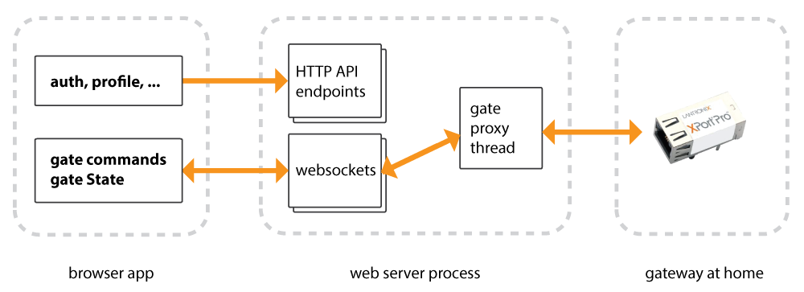
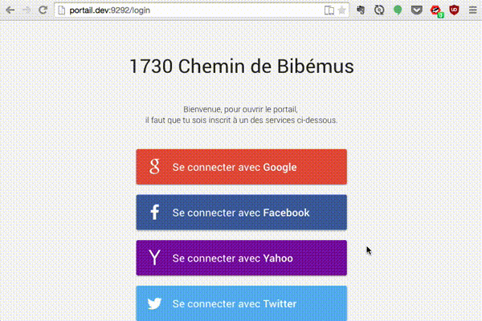

# Portail Notes

Notes on using sub-Ghz radios and a laser to control my home gate from the internet.

Main components are a [Lantronix XPort Pro](http://www.lantronix.com/device-networking/embedded-device-servers/xport-pro.html), two [Wizzimote nodes](http://www.wizzilab.com/solutions/wizzikit/), a [Banner L-GAGE LT3 laser](http://www.bannerengineering.com/en-US/products/sub/42), [PolymerJS](https://www.polymer-project.org/), [Riot-OS](http://www.riot-os.org/) and the C, [Ruby](https://www.ruby-lang.org/en/), and Javascript programming languages.


## Background


We just installed an automatic gate at home. It is far from the house and we didn't install an intercom. Those who live here can get in using a remote. And if you are a guest, there is a code you can dial if you know it.

*However, for security reasons, the code dial is disabled at night*. Now when a guest is trying to enter or leave during nighttime, we have to walk out to the gate and let them through with our remotes, which is annoying.

As a solution, I tasked myself to link the gate to the internet for remote control. We will be able to open it from anywhere and friends and family will be able to let themselves in.


## Disclaimer

These notes are from a personal educational project exploring electronics. Though I invested some effort into formatting and clarity, my note taking was sporadic.

The main goal of this endeavor was to learn electronics. I prioritized design decisions to maximize my learning experience, technical efficiency came in second. As a result, some design decisions of this project may be less than ideal from a technical point of view.

<div class="warn">
  This project is not yet complete, these notes are a work in progress.
</div>


## Code

* Web front-end: [portail-webclient](https://github.com/ximus/portail-webclient)
* Web back-end: [portail-webserver](https://github.com/ximus/portail-webserver)
* Firmwares: [portail-firmware](https://github.com/ximus/portail-firmware)
* Testing rig: [portail-mockgate](https://github.com/ximus/portail-mockgate)


## System Design

Visitors interact with a web app which communicates with an endpoint located at my house acting as gateway. This gateway in turn communicates with a module located near the gate interfacing with it.

This overview of the request flow gives a wide angle view:


### Web Stack

Javascript/HTML front-end with a Ruby back-end.



The web server and the browser client are clearly separated. The client is a standalone browser app that can run server-less given fake data. The server is headless and only serves API requests and a websocket. The websocket is used to keep the client informed about the state of the gate and for the client to send gate open and close commands.

Given the low scale, I left the API, the websocket endpoint and gate connection all in a single operating system process.

#### Client: Browser app using Polymer



Rationale: I wanted to experiment with web components.

Using web components was fun. Scope isolation and encapsulation simplifies the codebase. Polymer encourages declarative code, this was great, it helps decouples the HTML from CSS. Polymer is well written. I initially wrote an MVP using AngularJS. I've written a few small apps using Angular and though I liked it. Using Polymer I found myself fighting a lot less with the system. Code that I wrote would more consistently behave as intended. I ended up spending alot less time having to read documentation to understand abstract or unique concepts. Also, and this is quite revolutionary, I did not have to spend anytime in the bowels of Polymer ... This is a important point for my productivity and sanity.

Polymer still has some edges to round but it is a solid base and I am pleased to read that they are working on these edges.

#### Backend: Ruby

I should have just used [Rails](http://rubyonrails.org/). But I was curious to understand exactly what are the required parts of a web framework, so I wrote a custom stack. I am please with the end result, it isn't too complicated and it was educative.

<div class="side-note">
Why Ruby? I'm used to it, it's fun. Initially, I started using NodeJS as I thought some companies would appriciate that on my resume. I moved forward with not just one, but a few different NodeJS web frameworks. However I backed away from NodeJS frameworks after getting sick of having to implement my own plumbing too often. Javascript is fun in the browser but I prefer Ruby's syntax and ecosystem on the server by far.
</div>

### Hardware

There are two hardware modules. An internet gateway located at my house, where I have an internet connection. It relays communications between the internet and the module. The second piece module is located near the gate and interfaces with it.

For both devices I used an embedded OS for firmware. I initially wrote much bare metal code, but I quickly grew curious of what using an embedded OS looks like. I used [Riot-OS](http://www.riot-os.org/) on both. I had to fork it to write support for my wizzimote modules and tune resources requirements, [the fork is here](https://github.com/ximus/RIOT/tree/portail-and-wizzimote).

#### Home: Internet Gateway


I'm using a [Lantronix XPort Pro](http://www.lantronix.com/device-networking/embedded-device-servers/xport-pro.html) connected to a [Wizzimote node](http://www.wizzilab.com/solutions/wizzikit/).

When I chose this design I had little knowledge of electronics. With the confidence I now have, I would do it differently.

Why UDP? Why not. CoAP is often used with UDP so I started with it. CoAP provides message delivery guarantees, which is probably all I would need from TCP.

Why UART? The XPort is designed to interface over UART. This is the channel over which network packets are relayed to and from to the CC430.

The system only has two wireless nodes, so there was no opportunity to have fun and research IoT network routing. Riot-OS has many capabilities in that field. To keep things simple I am using the hardware radio packet facility provided by the CC430 chip.

<div class="side-note">
#### Why wizzimotes? Why Riot-OS?

Wizzimotes are modules intended to explore the [DASH7](http://www.dash7-alliance.org/) IoT network stack. They are low power and come with a an SDK. The SDK's core is a lightweight OS layer comprised of a [HAL](http://en.wikipedia.org/wiki/HAL_%28software%29), process management (using pthreads) and DASH7 radio lib. I initially started developing using these tools and exploring the SDK was very educative; it is lightweight, well written and compact. Then I came accross [Riot-OS](http://www.riot-os.org/).

I decided to switch over to Riot:

* Riot is open source and open to the public (Wizzlab's code wasn't). That means more contributors, and codebase likely more representative of industry coding standards.
* Riot was in line with my hardware: it already had support for the wizzimote's CC430 MCU and its 2Kb of RAM
* Riot was in line with my project goal. This is its current slogan: "The friendly Operating System for the Internet of Things"
* Riot was great opportunity to learn more about emebeded development. My main project goal was educational, I got to learn tons by digging into Riot.

In hindsight I wish I had selected modules more powerful than wizzimotes. Though they were fun, their resources are very limited and designed for ultra-low power applications, whereas I'm plugging in to the power grid.
</div>

#### Gate: Control and Observation


Located near the gate is a second Wizzimote. This one holds alot more code than its gateway sibling.

Its responsibilities include:

* Listen for and respond to network requests like "get gate status" or "open gate"
* Open or close the gate
* Report gate position
* Degrade gracefully upon laser obstruction (think car obstructing as it drives through)
* Degrade gracefully upon laser failure

Both a hardware [RC filter](https://en.wikipedia.org/wiki/RC_circuit) and an [exponentially weighed moving average](http://www.mcgurrin.com/robots/?p=154) are used to sooth gate position readings from the laser. The module incorportates domain knowledge on how the gate behaves in order to provide stable status responses when the laser is temporarely obstructed. During the intial one-time setup phase, the gate's average speed is measured allowing the module to detect laser obstruction and estimate gate position.

Communication with the module is done through the [CoAP](http://coap.technology/) protocol. Data is represented using [CBOR](http://cbor.io/). In the final project phases, either message signing or encryption will be added.

##### CoAP GET /gate (observeable)

requests to the gate status
response includes a code `s` representing the gate state and the position `p` of the gate represented as a number between 0 and 100.

```
{
  s: 2,
  p: 13
}
```

##### CoAP PUT /gate

used to change the gate's state to open or close it. Parameter `s` represents the status code. Accepteable values for `s` are 1 (open) and 4 (closed).

```
{
  s: 4
}
```

##### State representations

| code rep | string rep  | note                              |
| -------- | ----------- | --------------------------------- |
| 0        | unknown     | state unreadeable, laser offline?
| 1        | open        |                                   |
| 2        | opening     |                                   |
| 3        | open_partly | rare case                         |
| 4        | closed      |                                   |
| 5        | closing     |                                   |


## Testing: the mock gate

I built a fake gate for testing purposes.

I went travelling before finishing this project. I continued to development from abroad, but being away meant I didn't have access to the gate any longer. I had to find a way to test my prototype. Sensing yet another opportunity to learn electronics, I decided to build a mock gate in my room.

I gathered the following parts:

* An [Intel Edison](http://www.intel.com/content/www/us/en/do-it-yourself/edison.html)
* A [Sparkfun Motor block](https://www.sparkfun.com/products/13043) (breakout to a [TB6612FNG](https://www.sparkfun.com/datasheets/Robotics/TB6612FNG.pdf) chip)
* A [Sparkfun Base block](https://www.sparkfun.com/products/13045)
* A [Sparkfun GPIO block](https://www.sparkfun.com/products/13038)
* A unipolar stepper motor. (I didn't yet know the what unipolar meant when I got it)
* A basic [XY-MK-5V](http://www.plexishop.it/en/review/product/list/id/3688/category/313/) radio transmitter
* What seems like a bike rack, found on the street, to provide a structure

## Notes on learning electronics

* Negative to ground?
* http://microrobotics.co.uk/doc/pdf/D003_4-20mA_Inputs_App_Note.pdf
* http://www.mosaic-industries.com/embedded-systems/microcontroller-projects/measurement-techniques/instrumentation-amplifier-ground-loop-isolator
* oscilloscope use was cruicial for certitude, productivity


### PCB

<!-- insert bullet point of success points -->
* spongex better than metal sponge, use metal sponge for first pass on failed board
* double/triple print
* * dont use coton swabs, too many fibers get stuck around

#### useful:

* https://web.archive.org/web/20080827214718/http://www.mrdwab.com/john/How-to-make-PCBs.html
* http://www.instructables.com/id/Toner-transfer-no-soak-high-quality-double-sided/?ALLSTEPS
* http://www.msarnoff.org/pcb/

#### Coating

* http://www.electronics-project-design.com/ConformalCoating.html


## Assembly

Access to a workshop helped, pictures are the best record, [see below](#photos).

## [WIP][spin this] Notes on learning firmware development
http://homepages.inf.ed.ac.uk/dts/pm/Papers/nasa-c-style.pdf

## [WIP][spin this] Notes on using the xport
* fun with linux serial stack and how a what a linux driver looks like
* apis not so great, termio vs termios vs tty_ioctl, ...
* SDK well orgarnized, setup worked well, documentation pretty good.

## [WIP][spin this] Notes on how Riot OS works
* add explenations as to how riot works, diagrams. ex network layer, threads, processes


@@@ GET BACK TO THIS:

* using stat tools was great to charactirize signal.
* shows histogram screenshots, console
* mention ruby xport tests
* mention polymer was a more consistent, solid dev experience compared to angular. Less hacking about, less missed expections, less digging into the bowels of the beast and reading documentation, less abstract concepts

## Photos
There was some photographic record, [check it out](https://picasaweb.google.com/104618138749013524886/GateProject?authuser=0&feat=directlink)

<% content_for :footer do %>
  <br>
	<div data-google-album-id="6135261418453095361">
    <p>Loading images ...</p>
    <p>
      is your privacy blocker enabled?
    </p>
  </div>
<% end  %>